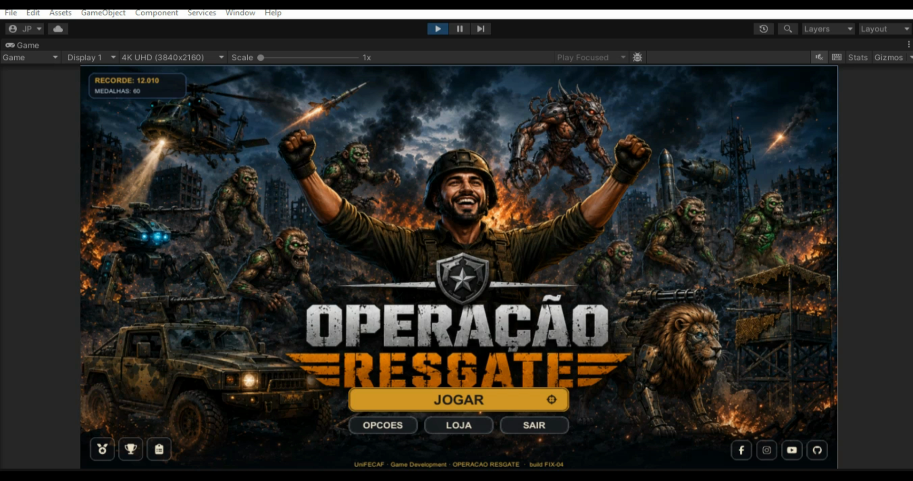
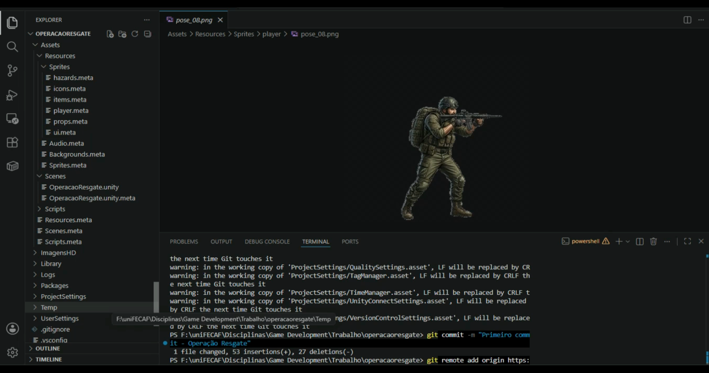
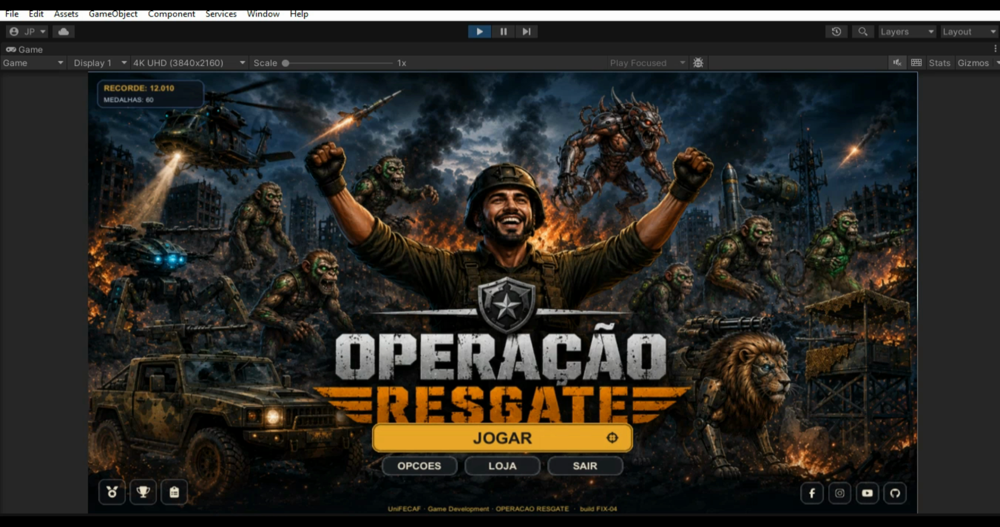
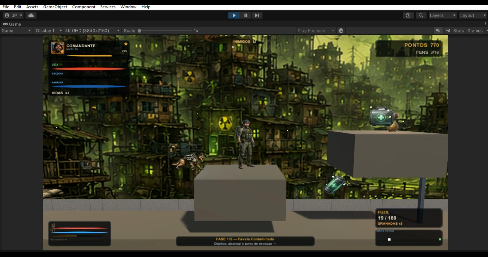
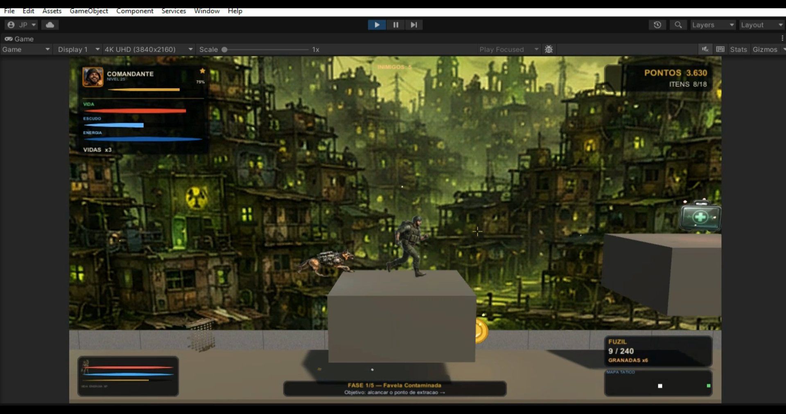
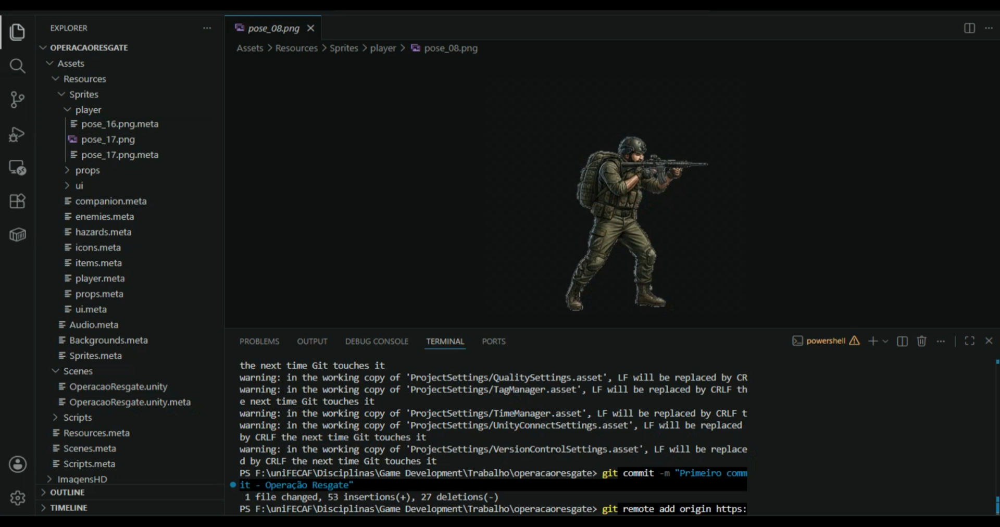
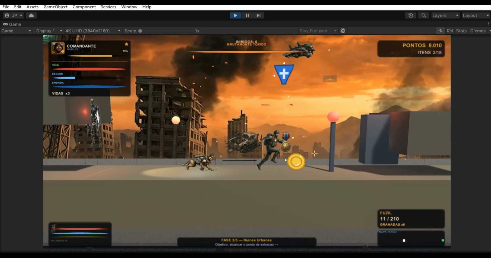
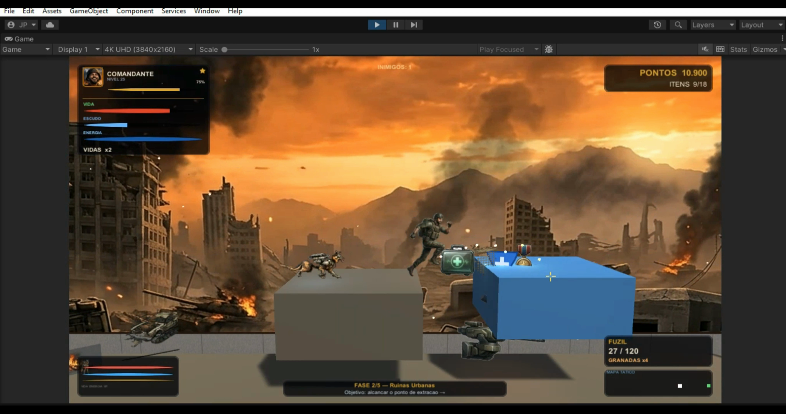

# 🪖 OPERAÇÃO RESGATE

**Jogo de plataforma de ação militar 2.5D** desenvolvido na **Unity (C#)** para a disciplina de **Game Development** do Centro Universitário **UniFECAF**.

> Um soldado de elite é enviado a uma cidade devastada por um desastre radioativo. Ao lado do **K9-CYBER ALPHA** — um pastor-alemão cibernético com inteligência artificial própria — ele precisa atravessar territórios dominados por criaturas mutantes e forças hostis até concluir a operação de resgate que dá nome ao jogo.

**Pilares do projeto:** 🎯 Estratégia · 💥 Ação · 🎖️ Missão

---

## 🔗 Links

- ▶️ **Vídeo pitch:** https://youtu.be/ZBHpeifeUcc
- 💻 **Repositório:** https://github.com/jhonwpsilva/operacaoresgate

---

## 🎮 Sobre o jogo

OPERAÇÃO RESGATE é um *run and gun* de plataforma com apresentação **2.5D**: a lógica do jogo é estritamente bidimensional, mas a cena usa câmera em perspectiva, iluminação dinâmica e paralaxe de fundo, entregando visual cinematográfico sem sacrificar a clareza espacial do gênero.

- ✅ **Movimentação completa** com *game feel* calibrado: andar, correr, pular com *coyote time* e *jump buffering*, **duplo pulo**, agachar, escalar, rolamento de esquiva com invulnerabilidade e deslize com salto encadeado.
- ✅ **Arsenal de 4 armas** orientado a dados (pistola, fuzil, espingarda e metralhadora) com balística, recuo, dispersão dinâmica, recarga temporizada e **mira livre em 360°** — além de granadas e golpe corpo a corpo.
- ✅ **K9-CYBER ALPHA**: companheiro com IA própria que segue o soldado, combate inimigos com 3 ataques por distância, cura o parceiro ferido, evolui até o nível 10 e comunica seu estado por LED colorido.
- ✅ **5 fases** com dificuldade crescente, culminando em batalha de chefe com padrões de ataque em fases.
- ✅ **HUD completo**: vida, vidas, pontuação, arma e munição (pente/reserva), retículo dinâmico e painéis do K9.
- ✅ **Feedback audiovisual abrangente**: clarão de cano, cápsulas ejetadas, tremor de câmera, faíscas, mais de 25 efeitos sonoros e trilha própria por fase.
- ✅ **Clima dinâmico** (chuva e vento), sistema de salvamento com persistência da evolução do K9 e telas completas (menu, pausa, game over, fase concluída e vitória).

---

## 📸 Prints das telas e níveis

*Capturas reais de gameplay (pasta [`Prints/`](Prints)).*

### Menu inicial


### Fase 1 — Favela Contaminada


### Fase 2 — Ruínas Urbanas (chuva e plataformas móveis)


### Fase 3 — Campo Radioativo


### Fase 4 — Linha de Frente


### Combate e HUD em ação


### Fase 5 — Batalha do Chefe (Sala de Comando)


### Tela de vitória


---

## 🕹️ Controles

| Ação | Entrada | Ação | Entrada |
|------|---------|------|---------|
| Mover | `A`/`D` ou setas | Atirar | Botão esq. do mouse / `J` |
| Correr | `Shift` | Mirar 360° | Movimento do mouse |
| Pular / duplo pulo | `Espaço`, `W` ou `↑` | Recarregar | `R` |
| Agachar | `S` ou `↓` | Trocar arma | `Q`, scroll ou `1`–`4` |
| Rolamento (esquiva) | `Ctrl` esquerdo | Granada | `G` |
| Deslize | Correr + agachar | Corpo a corpo | `V` ou `F` |
| Escalar | `W`/`S` na escada | Interagir | `E` |
| Pausar | `Esc` ou `P` | Confirmar | `Enter` |

---

## 🚀 Como abrir e jogar

### Pré-requisitos
- **Unity 2022.3.40f1 (LTS)** — instale pelo **Unity Hub**.
  *Qualquer versão 2022.3.x abre o projeto normalmente; o Hub pode sugerir um pequeno upgrade, basta aceitar.*

### Passos
1. Abra o **Unity Hub**.
2. Clique em **Add** → **Add project from disk**.
3. Selecione a pasta **`operacaoresgate`** (a que contém `Assets/`, `ProjectSettings/` e `Packages/`).
4. Abra o projeto. *(No primeiro carregamento a Unity importa os assets — pode levar alguns minutos.)*
5. Na janela **Project**, abra a cena **`Assets/Scenes/OperacaoResgate.unity`**.
6. Aperte **▶ Play**.

> 💡 **O jogo se monta sozinho.** Câmera, luz, interface e as cinco fases são criadas por código em tempo de execução — não é preciso configurar nada no editor.

---

## 📦 Como gerar o executável (.exe)

1. Menu **File → Build Settings…**
2. Confirme que a cena **`Scenes/OperacaoResgate`** está em *Scenes In Build* (senão, **Add Open Scenes**).
3. Em **Platform**, selecione **Windows, Mac, Linux** e clique em **Switch Platform** se necessário.
4. Clique em **Build**, escolha uma pasta de saída (ex.: `Build/`) e aguarde.
5. O executável `OperacaoResgate.exe` será gerado junto da pasta `OperacaoResgate_Data`.

> Para distribuição, compacte a pasta de build inteira em um `.zip`. Guia detalhado em [`COMO_EXPORTAR_EXE.md`](COMO_EXPORTAR_EXE.md).

---

## 🗂️ Estrutura do projeto

```
operacaoresgate/
├── Assets/
│   ├── Scenes/
│   │   └── OperacaoResgate.unity   # cena inicial (tudo é montado por código)
│   ├── Scripts/                    # +40 classes C# (namespace OperacaoResgate)
│   │   ├── Core/                   # estado do jogo, dados das fases, áudio, save, eventos
│   │   ├── Player/                 # controle, armas, saúde, granadas, animação
│   │   ├── Enemies/                # zumbi, mutante, robô, drone, torre, helicóptero, chefe
│   │   ├── World/                  # construtor de níveis, K9, plataformas, itens, clima
│   │   └── UI/                     # HUD, retículo, painéis do K9, menus, câmera
│   └── Resources/                  # sprites, cenários e áudio carregados em runtime
├── Prints/                         # 📸 capturas das telas e níveis
├── ImagensHD/                      # cenários e arte conceitual em alta resolução
├── ProjectSettings/                # versão da Unity e configurações
└── Packages/                       # dependências
```

---

## 🧩 Arquitetura técnica

Arquitetura **integralmente orientada a código (code-driven)**: níveis, personagens, interface, materiais e efeitos são construídos em tempo de execução a partir de uma camada declarativa de dados.

- **Game loop respeitado:** entrada e timers no `Update`, física via `Rigidbody` a 50 Hz no `FixedUpdate` (com *jump buffer*), câmera e HUD no `LateUpdate`.
- **Barramento de eventos de combate (padrão observer):** ao disparar, o jogador publica um evento; inimigos próximos "ouvem" e reagem — sem acoplamento entre classes.
- **Orientação a dados:** armas são fichas de atributos e fases são descrições declarativas — balancear é editar números, nunca reescrever lógica.
- **Desempenho:** *object pool* de efeitos (sem picos de GC), balística com `SphereCast`, detecção contínua de colisão e material físico sem atrito.
- **Animação:** máquina de estados em C# com 15 estados visuais + camadas processuais (inclinação de mira ±24°, giro de rolamento, respiração do K9).

---

## 🔊 Áudio

- **Trilha própria por fase**, tratada como camada de estado (troca com a fase, silencia na derrota, celebra na vitória).
- **Mais de 25 efeitos sonoros** sintetizados proceduralmente pelo próprio sistema — sem bancos de áudio externos.
- **Anti-fadiga e som posicional:** variação sutil de *pitch* entre repetições e atenuação pela distância.

---

## 🎨 Origem dos assets

- Folhas de sprites do soldado e do K9 produzidas para o projeto.
- Primitivas, materiais, partículas e interface gerados proceduralmente por código.
- Efeitos sonoros sintetizados pelo próprio sistema de áudio.

---

## 👤 Créditos

- **Desenvolvimento:** Jônata Silva Pinho — RA 115533
- **Instituição:** Centro Universitário UniFECAF
- **Disciplina:** Game Development
- **Engine:** Unity 2022.3 LTS · **Linguagem:** C#

---

*Projeto acadêmico desenvolvido como entregável da disciplina de Game Development — UniFECAF (2026).*
